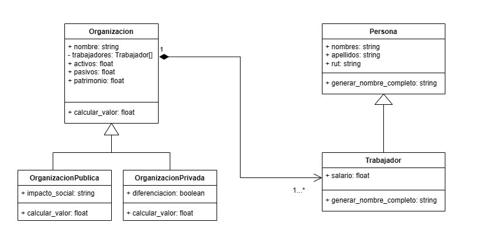

# Ejercicio Formativo 1 Capítulo 1

## Indice

- [Tema](#tema)
- [Diagrama de Clases](#diagrama-de-clases)
- [Código](#código)
    - [Consideraciones](#consideraciones)
    - [Clases](#clases)
        - [Organizacion](#organizacion)
        - [OrganizacionPublica](#organizacionpublica)
        - [OrganizacionPrivada](#organizacionprivada)
        - [Persona](#persona)
        - [Trabajador](#trabajador)
    - [Crear objetos](#crear-objetos)
        - [Objetos Trabajador](#objetos-trabajador)
        - [Objetos OrganizacionPublica](#objetos-organizacionpublica)
        - [Objetos OrganizacionPrivada](#objetos-organizacionprivada)
    - [Guardar objetos en lista y diccionario](#guardar-objetos-en-lista-y-diccionario)


## Tema

El tema seleccionado para la resolución de este ejercicio fue el de ***Organizaciones***, se considero que una organización es un grupo de personas que se unen para alcanzar un objetivo en común, y que tiene las siguientes características:

- **Nombre**: El nombre de la organización.
- **Trabajadores**: Los trabajadores que pertenecen a la organización.
- **Activos**: Los activos que posee la organización.
- **Pasivos**: Los pasivos que posee la organización.
- **Patrimonio**: El patrimonio de la organización.

Tambien se considero que toda organización tendrá una manera de **calcular su valor**.

Las organizaciones puede clasificarse en dos tipos:

- **Organización Pública**: Son aquellas organizaciones que pertenecen al estado. Este tipo de organizaciones tendrán una característica adicional que será el **impacto social** que tiene la organización en la sociedad.

- **Organización Privada**: Son aquellas organizaciones que pertenecen a particulares. Este tipo de organizaciones tendrán una característica adicional que será **diferenciación**, esta característica se refiere a la manera en que la organización se diferencia de las demás organizaciones.

Las organizaciones funcionan debido a que tienen personas trabajando en ellas, las personas en el contexto de este ejercicio tendrán las siguientes características:

- **Nombres**: Los nombres de la persona.
- **Apellidos**: Los apellidos de la persona.
- **rut**: El rut de la persona.

Cuando una persona es un trabajador de una organización, se considera que tiene una característica adicional que es el **salario** que recibe.

Además, se considera que **una organización puede tener uno o más trabajadores** pero **un trabajador solamente puede pertenecer a una organización**.

## Diagrama de Clases

Para la creación del diagrama de clases se utilizo [***draw.io***](https://app.diagrams.net/), el cual es una herramienta de diagramación online que permite la creación de diagramas de clases de manera sencilla.

Teniendo en cuenta la explicación del tema, se procedió a crear el siguiente diagrama de clases:



En este diagrama se puede observar que se crearon las clases **Organizacionn**, **OrganizacionPublica**, **OrganizacionPrivada**, **Persona** y **Trabajador**.

La clase **Organizacion** posee los atributos **nombre**, **trabajadores**, **activos**, **pasivos** y **patrimonio**, además del método **calcular_valor**. Es la clase padre de las clases **OrganizacionPublica** y **OrganizacionPrivada**, estás clases heredan los atributos y métodos de la clase **Organizacion**, pero además poseen atributos y métodos propios que las diferencian tales como **impacto_social** y **diferenciacion** respectivamente.

Una observación importante es que el atributo **trabajadores** de la clase **Organizacion** es **privado**, lo cual implica que solamente la clase **Organizacion** puede acceder a él. En el diagrama de clases esto se señala con el símbolo de **-** antes del nombre del atributo.

La clase **Persona** posee los atributos **nombres**, **apellidos** y **rut**, además del método **generar_nombre_completo**. La clase **Trabajador** hereda los atributos y métodos de la clase **Persona**, pero además posee el atributo **salario**.

La relación entre las clases **Organizacion** y **Trabajador** es de **composición**, esto se debe a que un trabajador solamente puede pertenecer a una organización, por lo que si la organización se destruye, los trabajadores también se destruyen. En el diagrama de clases esto se señala con un rombo relleno en la clase **Organizacion** y una flecha que apunta a la clase **Trabajador**. El hecho de que una organización pueda tener uno o más trabajadores se señala con el número **1** en la clase **Organizacion** y el símbolo **1..\*** en la clase **Trabajador**.

## Código

### Consideraciones

- Se utilizo la librería **abc**, en específico la clase **ABC** y la función **abstractmethod** para la creación de clases abstractas y métodos abstractos respectivamente. Esto con el fin de que las clases hijas **OrganizacionPublica** y **OrganizacionPrivada** implementen el método **calcular_valor**, ya que en caso contrario se generaría un error. Dicho esto, para la realización de lo solicitado en el enunciado del ejercicio esto no sería obligatorio y en su lugar podría usarse clases normales y métodos normales.

### Clases

- **Organizacion**

```python
class Organizacion(metaclass=ABCMeta):
    def __init__(self, nombre, trabajadores, activos, pasivos, patrimonio):
        self.nombre = nombre
        self.__trabajadores = trabajadores
        self.activos = activos
        self.pasivos = pasivos
        self.patrimonio = patrimonio

    @abstractmethod
    def calcular_valor(self):
        pass

    @abstractmethod
    def __str__(self):
        pass
```

En esta clase se definen los atributos **nombre**, **trabajadores**, **activos**, **pasivos** y **patrimonio**, además del método **calcular_valor** y el método **\_\_str\_\_**. El **_\_\_init\_\_** es el método constructor de la clase, este recibe como parámetros los atributos de la clase y los asigna a los atributos de la clase que lo necesitan y se ejecuta al momento de instanciar un objeto de la clase. El método **calcular_valor** es un método abstracto que se deja sin implementar al igual que el método **\_\_str\_\_**.

Como se dijo en incisos anteriores el atributo **trabajadores** es **privado**, esto se señala con el símbolo **\_\_** antes del nombre del atributo. 

Una observación importante es que cuando hacemos que la clase **Organizacion** herede de la clase **ABC** y le pasamos como parámetro **metaclass=ABCMeta**, lo que hace esta parte es indicar que la clase **Organizacion** es una clase abstracta. Por otro lado los decoradores **@abstractmethod** se utilizan para indicar que el método **calcular_valor** es un método abstracto, lo que significa que las clases hijas **OrganizacionPublica** y **OrganizacionPrivada** deben implementar este método, ya que en caso contrario se generaría un error.

- **OrganizacionPublica**

```python
class OrganizacionPublica(Organizacion):
    def __init__(
        self, nombre, trabajadores, activos, pasivos, patrimonio, impacto_social
    ):
        super().__init__(nombre, trabajadores, activos, pasivos, patrimonio)
        self.impacto_social = impacto_social

    def calcular_valor(self):
        valor_organizacion = self.activos + self.patrimonio - self.pasivos
        if self.impacto_social == "alto":
            valor_organizacion += 100
        elif self.impacto_social == "medio":
            valor_organizacion += 50
        else:
            valor_organizacion += 10
        return valor_organizacion

    def __str__(self):
        return f"Organización Pública: {self.nombre}"
```

Como se dijo previamente la clase **OrganizacionPublica** hereda de la clase **Organizacion**, por lo que posee los atributos **nombre**, **trabajadores**, **activos**, **pasivos**, **patrimonio** e **impacto_social**. Para lograr esto en el nombre de la clase se agrega **(Organizacion)** al lado del nombre de la clase, esto indica que la clase **OrganizacionPublica** hereda de la clase **Organizacion**. Además, en el constructor, se utiliza la función **super().\_\_init\_\_** que permite llamar al constructor de la clase padre y asignarle los atributos que le corresponden.

También se reescriben los métodos **calcular_valor** y **\_\_str\_\_**. En el método **calcular_valor** se calcula el valor de la organización y se le suma un valor adicional dependiendo del impacto social que tenga la organización. En el método **\_\_str\_\_** se retorna el nombre de la organización acompañado de un mensaje que indica que es una organización pública.

- **OrganizacionPrivada**

```python
class OrganizacionPrivada(Organizacion):
    def __init__(
        self, nombre, trabajadores, activos, pasivos, patrimonio, diferenciacion
    ):
        super().__init__(nombre, trabajadores, activos, pasivos, patrimonio)
        self.diferenciacion = diferenciacion

    def calcular_valor(self):
        valor_organizacion = self.activos + self.patrimonio - self.pasivos
        if self.diferenciacion:
            valor_organizacion += 100
        return valor_organizacion

    def __str__(self):
        return f"Organización Privada: {self.nombre}"
```

En esta clase se hace lo mismo que en la clase **OrganizacionPublica**, se hereda de la clase **Organizacion**, se llama al constructor de la clase padre y se reescriben los métodos **calcular_valor** y **\_\_str\_\_**. En el método **calcular_valor** se calcula el valor de la organización y se le suma un valor adicional si la organización tiene diferenciación. En el método **\_\_str\_\_** se retorna el nombre de la organización acompañado de un mensaje que indica que es una organización privada.

- **Persona**

```python
class Persona(metaclass=ABCMeta):
    def __init__(self, nombre, apellido, rut):
        self.nombre = nombre
        self.apellido = apellido
        self.rut = rut

    @abstractmethod
    def generar_nombre_completo(self):
        pass
```

En esta clase se hace lo mismo que en la clase **Organizacion**, se hereda de la clase **ABC**, se definen los atributos **nombre**, **apellido** y **rut**, además del método **generar_nombre_completo** pero este último es un método abstracto y se deja sin implementar.

- **Trabajador**

```python
class Trabajador(Persona):
    def __init__(self, nombre, apellido, rut, salario):
        super().__init__(nombre, apellido, rut)
        self.salario = salario
    
    def generar_nombre_completo(self):
        return f"Trabajador {self.nombre} {self.apellido}"
```

En esta clase se hace lo mismo que en la clase **OrganizacionPublica**, se hereda de la clase **Persona**, se llama al constructor de la clase padre y añaade el atributo **salario**. Además, se reescribe el método **generar_nombre_completo**.

### Crear objetos

- Objetos **Trabajador**

    ```python
    trabajador_1 = Trabajador("Juan", "Perez", "12345678-9", 400000)
    trabajador_2 = Trabajador("Maria", "Lopez", "12345678-0", 400000)
    trabajador_3 = Trabajador("Pedro", "Gonzalez", "12345678-1", 400000)
    trabajador_4 = Trabajador("Ana", "Gutierrez", "12345678-2", 400000)
    trabajador_5 = Trabajador("Jose", "Rodriguez", "12345678-3", 400000)
    trabajador_6 = Trabajador("Luis", "Diaz", "12345678-4", 400000)
    trabajador_7 = Trabajador("Carlos", "Martinez", "12345678-5", 400000)
    trabajador_8 = Trabajador("Fernanda", "Perez", "12345678-6", 400000)
    trabajador_9 = Trabajador("Miguel", "Lopez", "12345678-7", 400000)
    trabajador_10 = Trabajador("Sofia", "Gonzalez", "12345678-8", 400000)
    ```

    En este fragmento de código se crean 10 objetos de la clase **Trabajador**. Para ellos se les entrega cada uno de los parámetros que necesita el constructor de la clase.

    ```python
    lista_1 = [trabajador_1, trabajador_2]
    lista_2 = [trabajador_3, trabajador_4]
    lista_3 = [trabajador_5, trabajador_6]
    lista_4 = [trabajador_7, trabajador_8]
    lista_5 = [trabajador_9, trabajador_10]
    ```

    En este fragmento de código se crean 5 listas, cada una de ellas contiene 2 objetos de la clase **Trabajador**. Esto para que cada una de las listas sea asignada a una organización.

- Objetos **OrganizacionPublica**

    ```python
    ministerio_salud_chile = OrganizacionPublica("Ministerio de Salud", lista_1, 60000000, 3000000, 40000000, "alto")
    conaf = OrganizacionPublica("CONAF", lista_2,  60000000, 3000000, 40000000, "medio")
    ministerio_educacion_chile = OrganizacionPublica("Ministerio de Educación", lista_3,  60000000, 3000000, 40000000, "bajo")
    ministerio_energia_chile = OrganizacionPublica("Ministerio de Energía", lista_4,  60000000, 3000000, 40000000, "alto")
    ministerio_justicia_chile = OrganizacionPublica("Ministerio de Justicia", lista_5,  60000000, 3000000, 40000000, "alto")
    servicio_de_aduanas = OrganizacionPublica("Servicio de Aduanas", lista_1,  60000000, 3000000, 40000000, "alto")
    servicio_de_impuestos_internos = OrganizacionPublica("Servicio de Impuestos Internos", lista_2,  60000000, 3000000, 40000000, "medio")
    servicio_nacional_del_consumidor = OrganizacionPublica("Servicio Nacional del Consumidor", lista_3,  60000000, 3000000, 40000000, "medio")
    servicio_nacional_de_la_discapacidad = OrganizacionPublica("Servicio Nacional de la Discapacidad", lista_4,  60000000, 3000000, 40000000, "medio")
    servicio_nacional_de_la_mujer = OrganizacionPublica("Servicio Nacional de la Mujer", lista_5,  60000000, 3000000, 40000000, "alto")
    ```

    En este fragmento de código se crean 10 objetos de la clase **OrganizacionPublica**. Para ellos se les entrega cada uno de los parámetros que necesita el constructor de la clase.

- Objetos **OrganizacionPrivada**

    ```python
    banco_de_chile = OrganizacionPrivada("Banco de Chile", lista_1,  80000000, 5000000, 50000000, True)
    entel = OrganizacionPrivada("Entel", lista_2, 80000000, 5000000, 50000000, True)
    cencosud = OrganizacionPrivada("Cencosud", lista_3, 80000000, 5000000, 50000000, True)
    latam = OrganizacionPrivada("Latam", lista_4, 80000000, 5000000, 50000000, True)
    falabella = OrganizacionPrivada("Falabella", lista_5, 80000000, 5000000, 50000000, True)
    ripley = OrganizacionPrivada("Ripley", lista_1, 80000000, 5000000, 50000000, True)
    santander = OrganizacionPrivada("Santander", lista_2, 80000000, 5000000, 50000000, True)
    bci = OrganizacionPrivada("BCI", lista_3, 80000000, 5000000, 50000000, True)
    bice = OrganizacionPrivada("BICE", lista_4, 80000000, 5000000, 50000000, True)
    itau = OrganizacionPrivada("Itau", lista_5, 80000000, 5000000, 50000000, True)
    codelco = OrganizacionPrivada("Codelco", lista_1, 80000000, 5000000, 50000000, False)
    enel = OrganizacionPrivada("Enel", lista_2, 80000000, 5000000, 50000000, False)
    aes_gener = OrganizacionPrivada("AES Gener", lista_3, 80000000, 5000000, 50000000, False)
    colbun = OrganizacionPrivada("Colbun", lista_4, 80000000, 5000000, 50000000, False)
    latam = OrganizacionPrivada("Latam", lista_5, 80000000, 5000000, 50000000, False)
    ```

    En este fragmento de código se crean 15 objetos de la clase **OrganizacionPrivada**. Para ellos se les entrega cada uno de los parámetros que necesita el constructor de la clase.

### Guardar objetos en lista y diccionario

```python
lista_organizaciones = [ministerio_salud_chile, conaf, ministerio_educacion_chile, ministerio_energia_chile, ministerio_justicia_chile, servicio_de_aduanas, servicio_de_impuestos_internos, servicio_nacional_del_consumidor, servicio_nacional_de_la_discapacidad, servicio_nacional_de_la_mujer, banco_de_chile, entel, cencosud, latam, falabella, ripley, santander, bci, bice, itau, codelco, enel, aes_gener, colbun, latam]
```

```python
diccionario_organizaciones = {ministerio_salud_chile.nombre: ministerio_salud_chile, conaf.nombre: conaf, ministerio_educacion_chile.nombre: ministerio_educacion_chile, ministerio_energia_chile.nombre: ministerio_energia_chile, ministerio_justicia_chile.nombre: ministerio_justicia_chile, servicio_de_aduanas.nombre: servicio_de_aduanas, servicio_de_impuestos_internos.nombre: servicio_de_impuestos_internos, servicio_nacional_del_consumidor.nombre: servicio_nacional_del_consumidor, servicio_nacional_de_la_discapacidad.nombre: servicio_nacional_de_la_discapacidad, servicio_nacional_de_la_mujer.nombre: servicio_nacional_de_la_mujer, banco_de_chile.nombre: banco_de_chile, entel.nombre: entel, cencosud.nombre: cencosud, latam.nombre: latam, falabella.nombre: falabella, ripley.nombre: ripley, santander.nombre: santander, bci.nombre: bci, bice.nombre: bice, itau.nombre: itau, codelco.nombre: codelco, enel.nombre: enel, aes_gener.nombre: aes_gener, colbun.nombre: colbun, latam.nombre: latam}
```

En los fragmentos de código anteriores se crean una lista y un diccionario que contienen todos los objetos de las clases **OrganizacionPublica** y **OrganizacionPrivada**. En el diccionario se utiliza el nombre de la organización como llave y el objeto como valor. Se coloco el nombre de la organización accediendo al atributo **nombre** de cada objeto, esto a fin de evitar errores al escribir el nombre.

### Pregunta sobre tiempo de búsqueda en lista y diccionario

Se nos preguntaba: ***si tuvieras qué buscar un objeto con un nombre específico en estas estructuras, ¿en cuál de las dos ser ́ıa más rápido encontralo y por qué?***

La respuesta a esto es que sería más rápido en un diccionario ya que el **acceder a un valor en un diccionario es de tiempo constante**, es decir, **no depende de la cantidad de elementos del diccionario**. Por otro lado, en una lista el tiempo de búsqueda depende de la cantidad de elementos que tenga la lista.

El siguiente fragmento de código permite corroborar esto:

```python
inicio = time.time()

for organizacion in lista_organizaciones:
    if organizacion.nombre == "Santander":
        break

fin = time.time()
print(fin-inicio)

0.0009989738464355469
```

```python
inicio = time.time()

organizacion_santander = diccionario_organizaciones["Santander"]

fin = time.time()
print(fin-inicio)

6.580352783203125e-05
```
Como se puede observar, el tiempo que tarda en encontrar el objeto en el diccionario es mucho menor que el tiempo que tarda en encontrarlo en la lista.