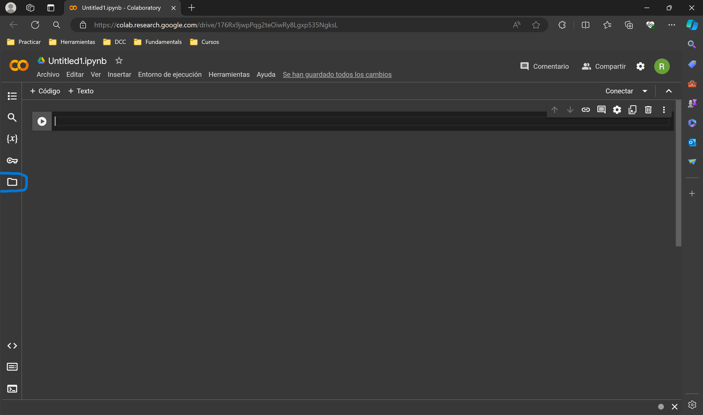
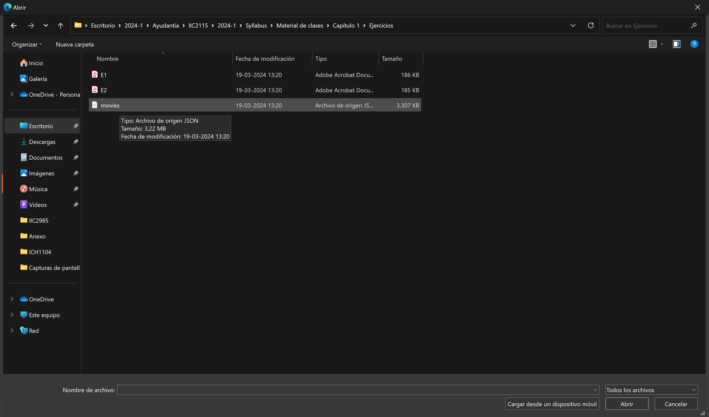
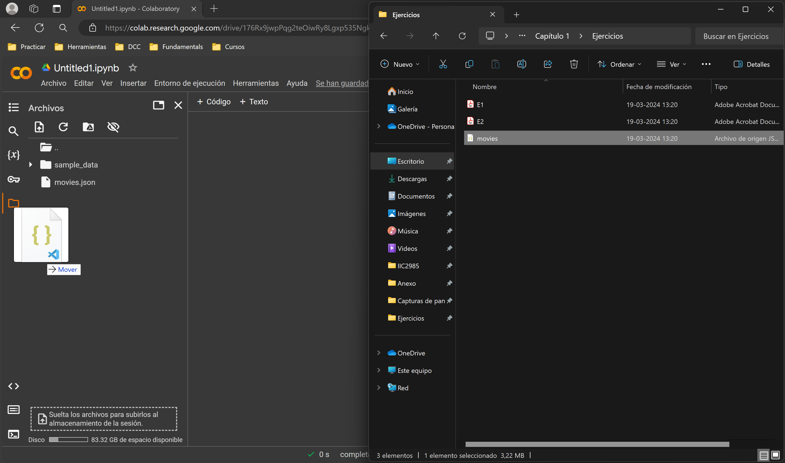

# Ayudantía 1

## Subir archivo a Colab

Para subir archivos a Colab se puede hacer lo siguiente:

1. Abrir un cuadero de Colab

2. Ir a la pestaña de archivos

3. Seleccionar la opción de subir.

4. Seleccionar el archivo que se desea subir.

5. Listo, el archivo se encuentra en la carpeta de Colab.

6. En caso de que el botón de subir no funcione, es posible arrastrar al archivo a la carpeta de Colab.

