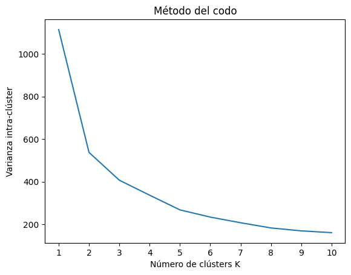
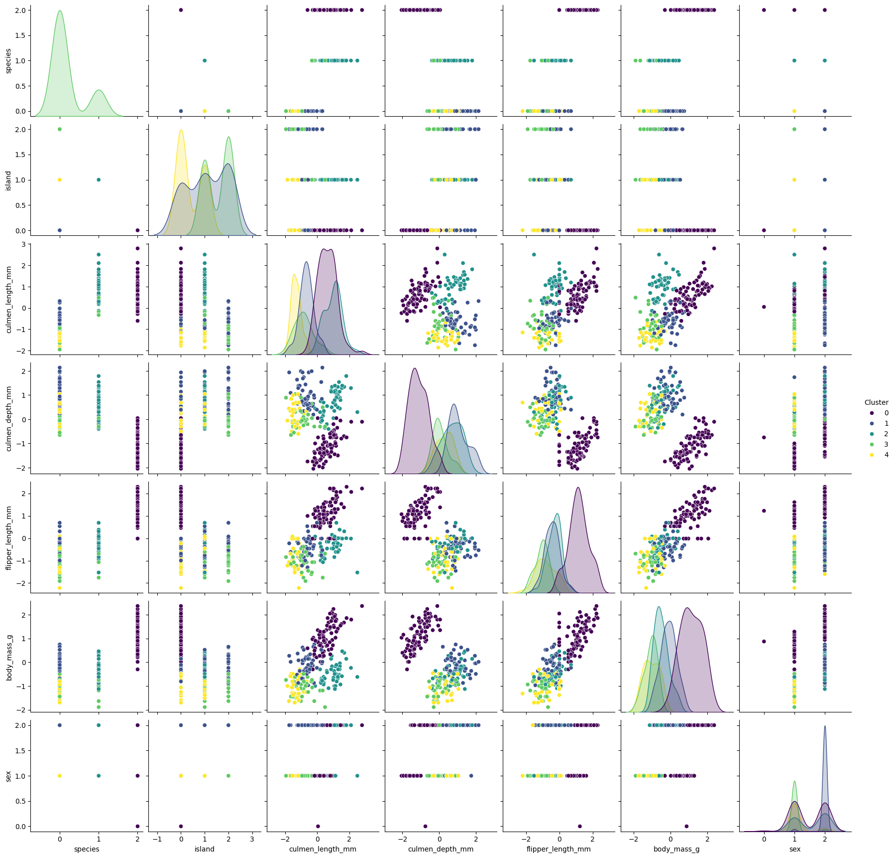

# Ejercicio Formativo 1 Capítulo 3

## Indice

- [Mision 1: Completando información](#mision-1-completando-información)
  * [¿Qué hace este código?](#-qué-hace-este-código-)
- [Mision 2: Preparación de los datos](#mision-2-preparación-de-los-datos)
    * [¿Qué hace este código?](#-qué-hace-este-código--1)
- [Mision 3: Análisis exploratorio visual](#mision-3-análisis-exploratorio-visual)
- [Misión 4: Análisis de clusters](#misión-4-análisis-de-clusters)
    * [¿Qué hace este código?](#-qué-hace-este-código---1)
- [Misión 5: Predicción de la especie](#misión-5-predicción-de-la-especie)


## Mision 1: Completando información

Se nos solicita completar la información numérica faltante utilizando el valor promedio de cada columna. Y a continuación, descartar los registros para los cuales hay variables categóricas con valores faltantes.

Para llevar a cabo lo primero se utiliza el siguiente código:

```python
numerical_columns = ['culmen_length_mm', 'culmen_depth_mm', 'flipper_length_mm', 'body_mass_g']
```

```python
for column in numerical_columns:
    df[column] = df[column].fillna(df[column].mean())
```

```python
df.apply(lambda x: sum(x.isnull()),axis=0) 
```

```
species               0
island                0
culmen_length_mm      0
culmen_depth_mm       0
flipper_length_mm     0
body_mass_g           0
sex                  10
dtype: int64
```

### ¿Qué hace este código?

Este código hace lo siguiente:

1. Se crea una lista con los nombres de las columnas numéricas.
2. Se recorre la lista de columnas numéricas y se rellenan los valores faltantes con el promedio de cada columna. Par esto se usa el método `fillna()` de pandas. El cual busca los valores faltantes y los reemplaza por el valor que se le pase como argumento.
3. Se verifica si hay valores faltantes en el DataFrame.

Como se puede observar, después de rellenar los valores faltantes con el promedio de cada columna, ya no hay valores faltantes en las columnas numéricas. Sin embargo, aún hay valores faltantes en la columna `sex`.

Para realizar lo segundo, se utiliza el siguiente código:

```python
df = df.dropna()
```

```python
df.apply(lambda x: sum(x.isnull()),axis=0) 
```

```
species              0
island               0
culmen_length_mm     0
culmen_depth_mm      0
flipper_length_mm    0
body_mass_g          0
sex                  0
dtype: int64
```

### ¿Qué hace este código?

Este código elimina los registros para los cuales hay variables categóricas con valores faltantes. Para esto se utiliza el método `dropna()` de pandas. Este método elimina las filas que contienen valores faltantes.

Como se puede observar, después de eliminar los registros para los cuales hay variables categóricas con valores faltantes, ya no hay valores faltantes en el DataFrame.


## Mision 2: Preparación de los datos

Se nos solicita lo siguiente:

1. Codificación numérica de variables categóricas.
2. Separación en conjuntos de entrenamiento y test.
3. Escalamiento de variables numéricas

Para llevar a cabo lo primero se utiliza el siguiente código:

```python
categorical_columns = ['species', 'island', 'sex']
encoder_dict = {}
```

```python
from sklearn.preprocessing import LabelEncoder

for column in categorical_columns:
    label_encoder = LabelEncoder()
    df[column] = label_encoder.fit_transform(df[column])
    encoder_dict[column] = label_encoder
df.dtypes
```

Este código es prácticamente el mismo código del cuaderno del capítulo 3, y que se explico en el README de la carpeta __Ayudantía 3__. La diferencia radica en que ahora se estan codificando varias columnas y para cada una de ellas se crea un objeto `LabelEncoder` y se guarda en un diccionario.

Para llevar a cabo lo segundo y lo tercero se usa el código del cuaderno del capítulo 3, y que se explico en el README de la carpeta __Ayudantía 3__, en específico las secciones __Creación de sets de entrenamiento y prueba (test)__ y __Escalamiento de variables numéricas__.

## Mision 3: Análisis exploratorio visual

Se nos solicita realizar un análisis exploratorio visual de los datos. Para llevar esto a cabo se utiliza el código del cuaderno del capítulo 3, y que se explico en el README de la carpeta __Ayudantía 3__, en específico la sección __Análisis exploratorio de datos__. La diferencia radica en los datos que se están analizando, debido a esto se procederá a analizar los gráficos resultantes.


En ambos gráficos se pueden diferenciar tres grupos que corresponden a las tres especies de pingüinos. Se puede decir que los grupos que corresponden a las especies 'Adelie' y 'Chinstrap' son difíciles de separar ya que se superponen, esto se denota más en el gráfico hecho con PCA que en el gráfico hecho con t-SNE. Por otro lado, el grupo que corresponde a la especie 'Gentoo' es fácil de separar de los otros dos grupos.

Para ver el tema de los outliers en los gráficos se puede ver que hay algunos puntos que se alejan significativamente de donde se agrupan otros puntos que corresponden a la misma especie, esto para las especies 'Adelie' y 'Gentoo' en el gráfico hecho con PCA. También se puede señalar que los datos perteneciente  a la especie 'Gentoo' se separan en dos grupos en el gráfico hecho con t-SNE. Esto puede ser un indicio de que hay dos subgrupos dentro de la especie 'Gentoo'.

### Misión 4: Análisis de clusters

Se nos solicita realizar un proceso de clústering sobre los datos, primero sobre los datos en su espacio de características
completo y luego sobre el espacio reducido generado en la misión anterior. Para ambos casos, obtenga el número óptimo de clusters con el método del codo.

Entonces los pasos a seguir para los tres casos (datos sin reducir, datos reducidos con PCA y datos reducidos con t-SNE) son los siguientes:

1. Encontrar el número óptimo de clusters con el método del codo.
2. Realizar el clústering con el número óptimo de clusters encontrado.
3. Visualizar los clusters obtenidos.

Para encontrar el número óptimo de clusters con el método del codo se utiliza el código visto en clases. Para esta parte solo se revisará como identificar el número óptimo de clusters a partir del gráfico obtenido con el método del codo.

```python
from sklearn.cluster import KMeans
```

```python
cluster_var = []

for i in range(1, 11):
    kmeans = KMeans(n_clusters = i, init = 'k-means++', max_iter = 300, n_init = 10, random_state = 0)
    kmeans.fit(training_set[features])
    cluster_var.append(kmeans.inertia_)
```

```python
from matplotlib.ticker import MaxNLocator
```

```python
ax = plt.figure().gca()
plt.plot(range(1, 11), cluster_var)
plt.title('Método del codo')
plt.xlabel('Número de clústers K')
plt.ylabel('Varianza intra-clúster')
ax.xaxis.set_major_locator(MaxNLocator(integer=True))
plt.show()
```




Se puede ver que el punto en el que deja de haber una disminución drástica es desde que se toma el valor 5 por ende el número óptimo de clusters es 5.

Este proceso se repite para los datos reducidos con PCA y t-SNE.

Para realizar el clústering con el número óptimo de clusters encontrado se utiliza el siguiente código, este es para los datos sin reducir, pero el código para los datos reducidos con PCA y t-SNE es similar.


```python
kmeans = KMeans(n_clusters=5)

kmeans_labels = kmeans.fit_predict(training_set_copy[features])

training_set_copy['Cluster'] = kmeans_labels

centroids = kmeans.cluster_centers_
```

#### ¿Qué hace este código?

Antes de describir el código se debe recordar que Kmeans utiliza el esquema de centroides, donde cada cluster es representado por un centroide. El objetivo de Kmeans es minimizar la suma de las distancias al cuadrado entre cada punto y el centroide de su cluster. El centroide vendría a ser el promedio de los puntos que pertenecen a un cluster.

Este código realiza el clústering con el número óptimo de clusters encontrado. Para esto se crea un objeto `KMeans` con el número óptimo de clusters encontrado. Luego se realiza el clústering con el método `fit_predict()`, lo que este método hace es asignar a cada punto del conjunto de entrenamiento el cluster al que pertenece. Luego, se añade una columna al conjunto de entrenamiento con los clusters asignados a cada punto. Finalmente, se obtienen los centroides de los clusters.

Para visualizar los clusters se debe tener en cuenta que dado que para los datos sin reducir se tienen 6 dimensiones (_features_), no se pueden visualizar los clusters en un gráfico. Y para obtener la información del comportamiento de los datos respecto a estas _features_ se puede utilizar el siguiente código:

```python
sns.pairplot(training_set_copy, hue='Cluster', palette='viridis')
plt.show()
```




Este gráfico lo único que hace es mostrar el comportamiento de los datos respecto a sus _features_ en distintas combinaciones en gráficos de 2D.

Para el caso de los datos reducidos con PCA y t-SNE se puede visualizar los clusters en un gráfico junto con los centroides. Para esto se utiliza el siguiente código:

```python
plt.figure(figsize=(20, 10))

sns.scatterplot(x='Componente 1', y='Componente 2', hue='Cluster', data=df_X_PCA, palette='viridis', legend='full')
plt.scatter(centroids[:, 0], centroids[:, 1], c='red', s=100, marker='x')

plt.title('Clustering con KMeans')
```


En este gráfico se puede ver los clusters obtenidos en el espacio reducido generado generado por PCA. Se puede ver que los clusters están bien definidos y que los centroides están aproximadamente en el centro de cada cluster.

Respecto a la relación entre la cantidad de clusters óptimo y los distintos valores que puede tomar la etiqueta, para este ejercicio se puede decir que no coinciden ya que la cantidad de especies es de 3 mientras que los clusters óptimos fueron de 5 en todos los casos.

También si se analiza el gráfico generado por t-SNE:


Se puede que hay un cluster que a su vez se separa en dos grupos, a fin de ver su relación con los datos originales se puede hacer un análisis de los datos que pertenecen a este grupo usando el siguiente código:

```python
print(list(zip([0, 1, 2, 3, 4], target_names)))
```

```
[(0, 'Adelie'), (1, 'Chinstrap'), (2, 'Gentoo')]
```

```python
cluster_stats = df_X_TSNE.groupby('Cluster')['species'].value_counts(normalize=True)

print(cluster_stats)
```

```
Cluster  species
0        0.0        0.600000
         1.0        0.366667
         2.0        0.033333
1        0.0        0.588235
         1.0        0.294118
         2.0        0.117647
2        0.0        0.475000
         1.0        0.425000
         2.0        0.100000
3        0.0        0.720000
         1.0        0.280000
4        0.0        0.757576
         1.0        0.212121
         2.0        0.030303
Name: proportion, dtype: float64
```

Al cluster que le pasa esto es al cluster 4, según lo que se puede ver este cluster esta formado en su mayoría por pingüinos de la especie 'Adelie' y en menor medida por pingüinos de la especie 'Chinstrap'. Lo cual es acorde a los resultado anteriores ya que los datos de estas dos especies en los gráficos de PCA y t-SNE sin aplicar clustering se superponían. Se puede realizar un analisis similar de los otros datos para ver si hay alguna relación entre los clusters y las especies de los pingüinos.

### Misión 5: Predicción de la especie

Se nos solicita realizar una predicción de la especie con las siguientes estrategias:

- Predicción tradicional: entrenamiento de modelos para predecir directamente la raza de cada pingüino.

- Predicción jerárquica: entrenamiento de dos modelos para predecir la raza del pingüino. El primero debe discriminar entre 1 raza y las otras 2, mientras que el segundo debe discriminar entre las dos que formaron el mismo grupo para el modelo anterior. Qué raza usar para cada grupo y modelo es una
decisión que debe tomar ud.

Para la primera estrategia se reutiliza el código del cuaderno del capítulo 3, y que se explico en el README de la carpeta __Ayudantía 3__, en específico la sección __Construcción de modelos predictivos__, ya que esto cumple con todo lo solicitado. Por ende solo se mostrarán los resultados:

Se usaron dos modelos:

- Arbol de descisión con una exactitud balanceada de 0.9646739130434782

- Random Forest con una exactitud balanceada de 0.9646739130434782

Para la segunda estrategia se realizo el siguiente procedimiento:

1. Crear una columna `group` en el set de datos que contenga los valores 1 y 2, donde 1 corresponde a la especie 'Adelie' y 2 corresponde a las especies 'Chinstrap' y 'Gentoo'.
2. Crear un set de entrenamiento y test para el primer modelo, donde se entrenará un modelo para predecir el grupo al que pertenece un pingüino.
3. Crear un set de entrenamiento y test para el segundo modelo, donde se entrenará un modelo para predecir la especie de un pingüino. Pero solo para los pingüinos que pertenecen al grupo 2.
4. Evaluar los modelos.

Para el primer paso se utiliza el siguiente código:

```python
hierarchical_df_groups = training_set.groupby('species')
```

```python
hierarchical_df_group_1 = hierarchical_df_groups.get_group(0)
hierarchical_df_group_2 = pd.concat([hierarchical_df_groups.get_group(1), hierarchical_df_groups.get_group(2)])
```

```python
hierarchical_df_group_1['group'] = 1
hierarchical_df_group_2['group'] = 2
```

```python
hierarchical_df = pd.concat([hierarchical_df_group_1, hierarchical_df_group_2])
```

Para el segundo paso se utiliza el siguiente código:

```python
hierarchical_training_set, hierarchical_test_set = train_test_split(hierarchical_df.copy(), test_size = 0.3)

print(f'Tamaño set entrenamiento: {len(hierarchical_training_set)}')
print(f'Tamaño set test: {len(hierarchical_test_set)}')
```

```python
features_columns = ['island', 'culmen_length_mm', 'culmen_depth_mm', 'flipper_length_mm', 'body_mass_g', 'sex']
```

```python
target = 'group'
model_1 = DecisionTreeClassifier()
model_1.fit(hierarchical_training_set[features_columns], hierarchical_training_set[target])
```

Para el tercer paso se utiliza el siguiente código:

```python
hierarchical_df_group_2_training_set, hierarchical_df_group_2_test_set = train_test_split(hierarchical_df_group_2.copy(), test_size = 0.3)

print(f'Tamaño set entrenamiento: {len(hierarchical_df_group_2_training_set)}')
print(f'Tamaño set test: {len(hierarchical_df_group_2_test_set)}')
```

```python
features_columns = ['island', 'culmen_length_mm', 'culmen_depth_mm', 'flipper_length_mm', 'body_mass_g', 'sex']
```

```python
target = 'species'
model_2 = RandomForestClassifier()
model_2.fit(hierarchical_df_group_2_training_set[features_columns], hierarchical_df_group_2_training_set[target])
```

Para el cuarto paso, para evaluar se sigue el siguiente procedimiento:

Se evalúa el primer modelo con el siguiente código, para ver a que grupo pertenecen los pingüinos:

```python
predictions_group = model_1.predict(hierarchical_test_set[features_columns])
```

```python
balanced_accuracy = metrics.balanced_accuracy_score(hierarchical_test_set['group'], predictions_group)
print(f'Exactitud balanceada: {balanced_accuracy}')
```

```
Exactitud balanceada: 0.9878048780487805
```

```python
print(predictions_group)
```

```
[2 2 2 1 2 2 1 1 1 1 1 2 2 2 1 2 2 2 1 1 1 1 1 2 2 2 2 1 2 1 2 2 2 2 1 2 2
 2 1 2 2 1 1 2 2 2 2 1 2 2 2 2 1 2 2 1 1 2 1 1 2 2 1 2 1 1 1 1 1 2]
```

Se ha evaluado el primer modelo, el cual tiene una exactitud balanceada de 0.9878. Además, se han obtenido las predicciones del modelo. Ahora para evaluar el siguiente modelo se debe de filtrar el set de test ya que solo se debe de evaluar con los pingüinos que pertenecen al grupo 2.

Los datos que pertenecen al grupo 1 se pueden obtener de la siguiente manera:

```python
test_set_group_1 = hierarchical_test_set[predictions_group == 1]
```

Los datos que pertenecen al grupo 2 se pueden obtener de la siguiente manera:

```python
test_set_group_2 = hierarchical_test_set[predictions_group == 2]
```

Se evalua el segundo modelo para clasificar las especies de los pingüinos que pertenecen al grupo 2 con el siguiente código:

```python
predictions_species = model_2.predict(test_set_group_2[features_columns])
```

```python
balanced_accuracy = metrics.balanced_accuracy_score(test_set_group_2['species'], predictions_species)
print(f'Exactitud balanceada: {balanced_accuracy}')
```

```
Exactitud balanceada: 1.0
```

```python
print(predictions_species)
```

```
[1 2 2 1 1 2 1 2 2 1 2 2 2 2 2 2 1 2 1 2 2 1 1 2 1 2 2 1 2 2 1 2 1 2 2 2 2 2 1 1]
```

Se ha evaluado el segundo modelo, el cual tiene una exactitud balanceada de 1.0. Además, se han obtenido las predicciones del modelo. Como es de esperar solo ha asignado valores 1 y 2, que son la codificación de las especies 'Chinstrap' y 'Gentoo' respectivamente. Respecto al rendimiento de los modelos se puede decir que son bastante buenos ya que ambos modelos tienen una exactitud balanceada mayor a 0.9, y que la precisión de ambos fue mayor usando la segunda estrategia en comparación a cuando clasificaron especies directamente.