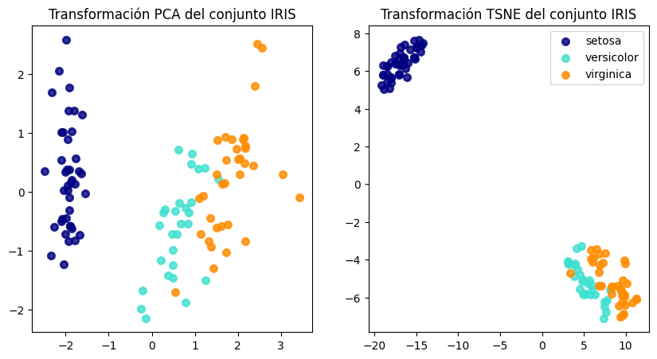

# Ayudantía 3 - Modelos Predictivos

## Indice

- [Introducción](#introducción)
- [¿Qué es lo que hace un modelo predictivo?](#qué-es-lo-que-hace-un-modelo-predictivo)
- [Codificación numérica de variables categóricas](#codificación-numérica-de-variables-categóricas)
  - [¿Qué es lo que hace esto código?](#¿qué-es-lo-que-hace-esto-código)
  - [¿Qué valores tiene ahora la columna codificada?](#¿qué-valores-tiene-ahora-la-columna-codificada)
  - [¿Cómo puedo saber a que valor corresponde cada uno de estos valores?](#¿cómo-puedo-saber-a-que-valor-corresponde-cada-uno-de-estos-valores)
  - [Importante](#importante)
- [Creación de sets de entrenamiento y prueba (test)](#creación-de-sets-de-entrenamiento-y-prueba-test)
    - [¿Qué es lo que hace este código?](#¿qué-es-lo-que-hace-este-código)
- [Escalamiento de variables numéricas](#escalamiento-de-variables-numéricas)
    - [¿Qué es lo que hace este código?](#¿qué-es-lo-que-hace-este-código)
    - [¿Cómo este código evita el _data leakage_?](#¿cómo-este-código-evita-el-data-leakage)
- [Análisis exploratorio de datos](#análisis-exploratorio-de-datos)
    - [¿Qué es lo que hace este código?](#¿qué-es-lo-que-hace-este-código)
- [Construcción de modelos predictivos](#construcción-de-modelos-predictivos)
    - [¿Qué es lo que hace esta función?](#¿qué-es-lo-que-hace-esta-función)
    - [¿Cómo utilizo esta función?](#¿cómo-utilizo-esta-función)
    - [¿Qué significa el valor de precisión obtenido?](#¿qué-significa-el-valor-de-precisión-obtenido)


## Introducción

En este documento se explicará y complementará el código provisto en el cuaderno asociado al Capítulo 3, esto debido a que parte del desarrollo de la ayudantía se basa en dicho código.

## ¿Qué es lo que hace un modelo predictivo?

Un modelo predictivo es un modelo matemático que utiliza datos históricos para predecir eventos futuros.En general, un modelo predictivo se puede representar como una función matemática que recibe un conjunto de variables de entrada y entrega una variable de salida.

Dependiendo del tipo de aprendizaje de máquina al que pertenezca, un modelo predictivo puede ser de dos tipos:

- **Modelos de aprendizaje supervisado**: En este tipo de modelos, se cuenta con un conjunto de datos de entrenamiento que contiene las variables de entrada y la variable de salida. El objetivo es encontrar una función que relacione las variables de entrada con la variable de salida. Generalmente se usan para aplicaciones de _clasificación_ y _regresión_.

- **Modelos de aprendizaje no supervisado**: En este tipo de modelos, se cuenta con un conjunto de datos de entrenamiento que contiene solo las variables de entrada. El objetivo es encontrar patrones o estructuras en los datos. Generalmente se usan para aplicaciones de _clustering_ y _reducción de dimensionalidad_.

## Codificación numérica de variables categóricas

Como se vio en clases, es necesario codificar las variables categóricas a variables numéricas para poder trabajar con ellas en los modelos predictivos. Para esto, se pueden utilizar distintas técnicas, como por ejemplo Label Encoding. A continuación se analizará el código visto en clases:

```python
from sklearn.preprocessing import LabelEncoder

cat_vars = ['species']
label_encoder = LabelEncoder()
for i in cat_vars:
    iris_dataset[i] = label_encoder.fit_transform(iris_dataset[i])
iris_dataset.dtypes 
```
```
sepal_length    float64
sepal_width     float64
petal_length    float64
petal_width     float64
species           int32
dtype: object
```

### ¿Qué es lo que hace esto código?

Se debe recordar que la variable `iris_dataset` es un objeto Dataframe.

Lo que hace es lo siguiente:

1. Importa la librería LabelEncoder de sklearn.preprocessing.
2. Define una lista con las variables categóricas, en este caso solo `species`.
3. Crea un objeto LabelEncoder.
4. Itera sobre las variables categóricas y transforma las variables categóricas a numéricas. Para esto usa el método `fit_transform` del objeto LabelEncoder, el cual recibe como parámetro un arreglo de valores, por ejemplo un objeto del tipo Series, lo que hace internamente es ajustar y transformar los datos, retorna el arreglo transformado. Y este nuevo arreglo resultante, en este caso Series, se vuelven a asignar a la columna correspondiente en el Dataframe `iris_dataset`.
5. Por último, muestra el tipo de datos que tienen ahora las columnas, donde se puede verificar que todas las columnas contienen datos numéricos.

### ¿Qué valores tiene ahora la columna codificada?

```python
print(iris_dataset['species'].unique()) 
```

```
[0 1 2]
```

### ¿Cómo puedo saber a que valor corresponde cada uno de estos valores?

```python
print(label_encoder.inverse_transform([0,1,2]))
```

```
['setosa' 'versicolor' 'virginica']
```

Esto indica que:

- El valor 0 corresponde a 'setosa'.
- El valor 1 corresponde a 'versicolor'.
- El valor 2 corresponde a 'virginica'.

Sí solo se desea ver cuales son los valores originales (previo a la codificación) también se puede hacer:

```python
print(label_encoder.classes_)
```

```
['setosa' 'versicolor' 'virginica']
```

### Importante

Si bien un mismo objeto de LabelEncoder puede ser usado para codificar múltiples columnas, es importante tener en cuenta que si se desea hacer la transformación inversa, es necesario guardar el objeto LabelEncoder para cada columna, ya que si se usa el mismo objeto para todas las columnas, al hacer la transformación inversa, se obtendrán los valores originales de la última columna transformada.

## Creación de sets de entrenamiento y prueba (test)

Como se vio en clases, es necesario dividir el dataset en dos sets, uno de entrenamiento y otro de prueba. Para esto, se puede utilizar la función `train_test_split` de la librería `sklearn.model_selection`. A continuación se analizará el código visto en clases:

```python
training_set, test_set = train_test_split(iris_dataset.copy(), test_size = 0.3)

print(f'Tamaño set entrenamiento: {len(training_set)}')
print(f'Tamaño set test: {len(test_set)}')
```

### ¿Qué es lo que hace este código?

Lo que hace es lo siguiente:

1. Importa la función `train_test_split` de la librería `sklearn.model_selection`.
2. Divide el dataset en dos sets, uno de entrenamiento y otro de prueba. Para esto usa la función `train_test_split`, la cual recibe como parámetros el dataset a dividir y el tamaño del set de prueba. En este caso, se usa el 30% de los datos para el set de prueba.
3. Muestra el tamaño de los sets de entrenamiento y prueba.


## Escalamiento de variables numéricas

Como se vio en clases, es recomendable realizar una etapa de preprocesamiento de los datos antes de entregarlos a los modelos predictivos. Por ejemplo, es común normalizar cada _feature_ con el fin de que todas se encuentren en la misma escala. Pero hay que tener cuidado para evitar el _data leakage_, se debe ajustar el `StandardScaler` solo con los datos de entrenamiento y luego transformar los datos de prueba con el mismo `StandardScaler` ajustado. A continuación se analizará el código visto en clases:

```python
from sklearn.preprocessing import StandardScaler
scaler = StandardScaler()
features = ['sepal_length','sepal_width', 'petal_length', 'petal_width']

training_set[features] = scaler.fit_transform(training_set[features])
test_set[features] = scaler.transform(test_set[features])
```

### ¿Qué es lo que hace este código?

Lo que hace es lo siguiente:

1. Importa la librería StandardScaler de sklearn.preprocessing.
2. Crea un objeto StandardScaler.
3. Define una lista con las variables numéricas, en este caso `sepal_length`, `sepal_width`, `petal_length` y `petal_width`.
4. Normaliza las variables numéricas del conjunto de entrenamiento. Para esto usa el método `fit_transform` del objeto StandardScaler, el cual recibe como parámetro un arreglo de valores, por ejemplo un objeto del tipo DataFrame, lo que hace internamente es ajustar (calcular media y desviaión estándar) y transformar los datos, retorna el arreglo normalizado. Y este nuevo arreglo resultante, en este caso Dataframe, se vuelven a asignar a las columnas correspondientes en el Dataframe `training_set`.
5. Se transforman los datos de prueba. Para esto se usa el método `transform` del objeto StandardScaler, el cual recibe como parámetro un arreglo de valores, por ejemplo un objeto del tipo DataFrame, lo que hace internamente es transformar los datos, retorna el arreglo normalizado. Y este nuevo arreglo resultante, en este caso Dataframe, se vuelven a asignar a las columnas correspondientes en el Dataframe `test_set`.

### ¿Cómo este código evita el _data leakage_?

El código evita el _data leakage_ ya que el objeto `scaler` es ajustado solo con los datos de entrenamiento, y luego se usa este mismo objeto para transformar los datos de prueba. De esta forma, se asegura que los datos de prueba no influyan en la normalización de los datos de entrenamiento.

## Análisis exploratorio de datos

Para esta parte se utiliza modelos de aprendizaje no supervisado para _clustering_ y _reducción de dimensionalidad_. Respecto a esto último, se ven dos modelos: PCA y t-SNE. Antes de ver el código se deben de tener en cuenta los siguientes puntos:

- PCA: Es un método de reducción de dimensionalidad que busca proyectar los datos en un nuevo espacio de menor dimensión, de tal forma que se maximice la varianza de los datos proyectados. Es importante tener en cuenta que PCA es un método lineal, por lo que no es capaz de capturar relaciones no lineales entre las variables.

- t-SNE: Es un método de reducción de dimensionalidad no lineal que busca proyectar los datos en un nuevo espacio de menor dimensión, de tal forma que se preserven las distancias entre los datos. Es importante tener en cuenta que t-SNE es un método estocástico, por lo que cada vez que se ejecute, los resultados pueden variar. Debido a que tratan de preservar las distancias, t-SNE es muy útil para visualizar datos en 2D o 3D.

A continuación se analizará el código visto en clases:

```python
import matplotlib.pyplot as plt
from sklearn.decomposition import PCA
from sklearn.manifold import TSNE

import warnings
warnings.filterwarnings("ignore", category=FutureWarning)

colors = ["navy", "turquoise", "darkorange"]
target_names = label_encoder.inverse_transform([0, 1, 2])

X_PCA = PCA(n_components=2).fit_transform(training_set[features])
X_TSNE = TSNE(n_components=2).fit_transform(training_set[features])

plt.figure(figsize=(10,5))

plt.subplot(1,2,1)
for color, i, target_name in zip(colors, [0, 1, 2], target_names):
    plt.scatter(X_PCA[training_set['species'] == i, 0], X_PCA[training_set['species'] == i, 1], color=color, alpha=0.8, lw=2, label=target_name)
#plt.legend(loc="best", shadow=False, scatterpoints=1)
plt.title("Transformación PCA del conjunto IRIS")

plt.subplot(1,2,2)
for color, i, target_name in zip(colors, [0, 1, 2], target_names):
    plt.scatter(X_TSNE[training_set['species'] == i, 0], X_TSNE[training_set['species'] == i, 1], color=color, alpha=0.8, lw=2, label=target_name)
plt.title("Transformación TSNE del conjunto IRIS")

plt.legend(loc="best", shadow=False, scatterpoints=1);
```


### ¿Qué es lo que hace este código?

Lo que hace es lo siguiente:

1. Importa las librerías necesarias.
2. Define una lista con los colores a utilizar en el gráfico.
3. Define una lista con los nombres de las especies. Para esto usa el método `inverse_transform` del objeto LabelEncoder el cual se mostró anteriormente.
4. Se llevan a cabo diversas acciones con el modelo PCA, en la siguiente línea:

    ```python
    X_PCA = PCA(n_components=2).fit_transform(training_set[features])
    ```

    Se realizan varias acciones, las cuales son:

    1. Se crea un objeto PCA con 2 componentes. Esto significa que se desea proyectar los datos en un espacio de 2 dimensiones.
    2. Se ajusta el objeto PCA con los datos de entrenamiento. Para esto se usa el método `fit_transform` del objeto PCA, el cual recibe como parámetro un arreglo de valores, por ejemplo un objeto del tipo DataFrame, lo que hace internamente es ajustar y transformar los datos, retorna el arreglo proyectado. Y este nuevo arreglo resultante, en este caso un arreglo de NumPy, se asigna a la variable `X_PCA`.
5. Se llevan a cabo las mismas acciones pero con el modelo t-SNE.
6. Se crea una figura con dos subgráficos.
7. Se grafican los datos proyectados por PCA en el primer subgráfico.
8. Se grafican los datos proyectados por t-SNE en el segundo subgráfico.
9. Para los últimos dos pasos usan los colores y nombres de las especies definidos anteriormente. También se usa la función `zip`, esta función recibe como parámetros dos o más listas y retorna un iterador que agrega los elementos de las listas en tuplas. En este caso, se usa para recorrer los colores, los índices y los nombres de las especies al mismo tiempo.

El analisis del gráfico se puede encontrar en el cuaderno asociado al capítulo asi que no se ahondará más en esa parte.

## Construcción de modelos predictivos

Para la creación de los modelos predictivos, generalemente son los mismos pasos, teniendo en cuenta que los modelos serán respecto al mismo tipo de aprendizaje máquina, por ejemplo para el __aprendizaje supervisado__ se siguen los siguientes pasos:

1. Importar el modelo y las métricas a utilizar.
2. Definir las características o _features_ y la variable objetivo.
3. Crear el modelo.
4. Entrenar el modelo.
5. Realizar predicciones.
6. Evaluar el modelo.

Debido a esto es posible generar funciones que realicen estos pasos de tal manera que el código y los resultados sean más ordenados, un ejemplo de esto se vio en el código entregado en clase. A continuación se analizara:

```python
from sklearn import metrics

def training_and_eval(model, training, eval, features, target):
    model.fit(training[features], training[target])
    predictions = model.predict(eval[features])
    accuracy = metrics.accuracy_score(predictions, eval[target])
    print(f"Accuracy: {accuracy: .2}")
```

### ¿Qué es lo que hace esta función?

Lo que hace es lo siguiente:

1. Recibe como parámetros el modelo a utilizar, los datos de entrenamiento, los datos de evaluación, las características o _features_ y la variable objetivo.
2. Entrena el modelo con los datos de entrenamiento. Para esto usa el método `fit` del objeto modelo, el cual recibe como parámetros las características y la variable objetivo de los datos de entrenamiento.
3. Realiza predicciones con los datos de evaluación. Para esto usa el método `predict` del objeto modelo, el cual recibe como parámetro las características.
4. Calcula la precisión del modelo. Para esto usa la función `accuracy_score` de la librería `sklearn.metrics`, la cual recibe como parámetros las predicciones y la variable objetivo de los datos de evaluación. Retorna la precisión del modelo.

### ¿Cómo utilizo esta función?

A continuación se analizará el código visto en clases donde se utiliza esta misma función:

```python
from sklearn.tree import DecisionTreeClassifier

target = 'species'
model = DecisionTreeClassifier()
training_and_eval(model, training_set, test_set, features, target)
```

```
Accuracy:  0.93
```

Lo que hace es lo siguiente:

1. Importa el modelo `DecisionTreeClassifier` de la librería `sklearn.tree`.
2. Define la variable objetivo, en este caso `species`.
3. Crea un objeto `DecisionTreeClassifier`.
4. Llama a la función `training_and_eval` con los parámetros correspondientes.

### ¿Qué significa el valor de precisión obtenido?

El valor de precisión obtenido es el porcentaje de predicciones correctas que realizó el modelo. En este caso, el modelo `DecisionTreeClassifier` obtuvo una precisión del 93%, lo que significa que el 93% de las predicciones realizadas por el modelo fueron correctas.

Los conceptos y códigos vistos en este documento son fundamentales importantes para comprender el desarrollo de la ayudantía, debido a que como se mencionó al principio se reutilizan bastantes de estos códigos pero añadiendo más complejidad y conceptos nuevos.
